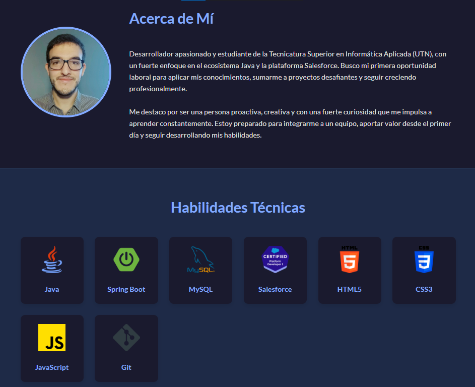

# Portfolio Interactivo con Asistencia de IA

Este es un portfolio web interactivo desarrollado como Trabajo Práctico para el curso **IA Aplicada a Contextos Organizacionales**.

El proyecto está desplegado y puede ser visitado en vivo.

**[➡️ Ver el Portfolio en Vivo](https://franciscogua.github.io/tp-ia-portfolio/)**

---

## 📝 Acerca del Proyecto

El objetivo de este trabajo fue construir una aplicación web funcional desde cero, documentando todo el proceso y utilizando un sistema de Inteligencia Artificial Generativa como herramienta de asistencia y co-creación en cada etapa del ciclo de desarrollo.

El resultado es un portfolio personal, interactivo y totalmente responsive, diseñado para presentar mi perfil profesional, habilidades y proyectos de una manera moderna y atractiva.

## ✨ Características Implementadas

- **Diseño Totalmente Responsive:** Adaptable a cualquier dispositivo, desde móviles hasta escritorios.
- **Selector de Idioma (Español/Inglés):** Implementa un sistema dinámico con JavaScript para cambiar todo el contenido textual de la página sin necesidad de recargarla.
- **Modo Claro y Oscuro (Theme Switcher):** Permite al usuario elegir su tema visual preferido. La elección se guarda en `localStorage`, por lo que la página recordará la preferencia en futuras visitas.
- **Modales Interactivos:** Las tarjetas de certificaciones y educación son clicables, abriendo un pop-up (modal) con información detallada sobre cada ítem.
- **Animaciones Suaves:** Las secciones de la página aparecen con una sutil animación de "fade-in" a medida que el usuario hace scroll, mejorando la experiencia de navegación.
- **Favicon y Iconografía Profesional:** Uso de iconos para una identificación visual clara de las tecnologías y enlaces.

## 🛠️ Stack Tecnológico

- **Frontend:** `HTML5`, `CSS3`, `JavaScript (ES6+)`
- **Asistente de IA:** Se utilizó un modelo de lenguaje avanzado (similar a GPT-4/Gemini) para asistir en diversas tareas del proyecto.
- **Iconografía:** [Font Awesome](https://fontawesome.com/)
- **Hosting:** [GitHub Pages](https://pages.github.com/)

## 🤖 Uso de la IA en el Proyecto

Siguiendo la consigna principal, la IA fue un "copiloto" clave durante todo el proyecto:

1.  **Ideación y Planificación:** Se utilizó la IA para generar una lista de ideas iniciales para la aplicación y para esbozar la primera estructura semántica del portfolio en HTML.
2.  **Generación de Código:** Creación de bloques de código base para HTML, estilos CSS (incluyendo el diseño `responsive` inicial) y funciones complejas de JavaScript.
3.  **Diseño de Lógica de Aplicación:** Asistencia fundamental en el diseño de la lógica para las funcionalidades más destacadas:
    - El sistema de traducción mediante objetos de JavaScript.
    - La implementación del modal interactivo.
    - La lógica para el interruptor de tema (Light/Dark mode) y el uso de `localStorage`.
4.  **Refactorización y Debugging:** Se consultó a la IA para obtener sugerencias sobre cómo optimizar el código, limpiar el CSS redundante y solucionar errores estructurales en el HTML.
5.  **Redacción y Contenido:** La IA ayudó a refinar y traducir los textos descriptivos del portfolio para asegurar que fueran claros y profesionales tanto en español como en inglés.
